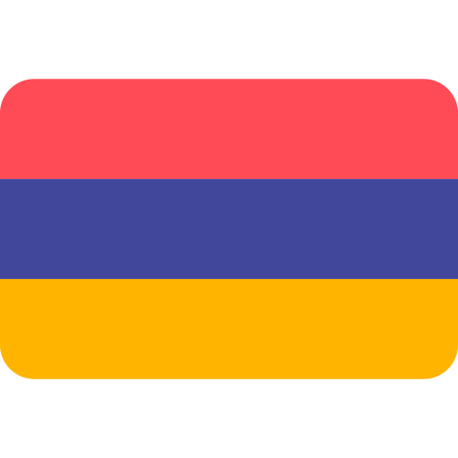
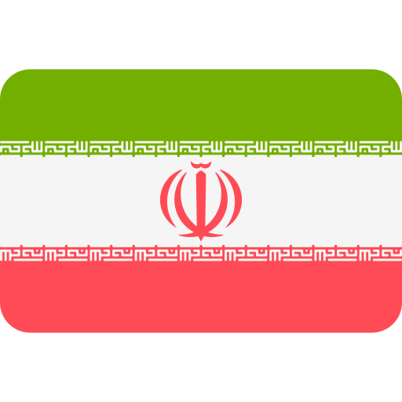

# 👋 Hey there!

## 💻 About Me

I'm Shara, an enthusiast who loves everything related to computers, programming, and design. I find joy in crafting digital experiences and bringing ideas to life through code and creativity.

## 🎓 Background

I hold a Bachelor's degree in Computer Science, where I developed a passion for problem-solving and innovation through technology. My education provided me with a solid understanding of programming, software development, and design principles, which laid the groundwork for my skills in Python, JavaScript, and web technologies.

## 💡 Interests

- 💻 Computer Programming: I enjoy transforming ideas into functional software solutions, constantly pushing the boundaries of what's possible.
- 🎨 Designing: Creating visually appealing designs that not only look great but also enhance user experiences is something I'm genuinely passionate about.

## 🛠️ Skills

## 🌐 Languages

| Language                                                                                                      | Proficiency     |
| ------------------------------------------------------------------------------------------------------------- | --------------- |
|  Armenian      | Native language |
|  Persian          | Fluent          |
|  English | Intermediate    |

## 📫 How To Reach Me

