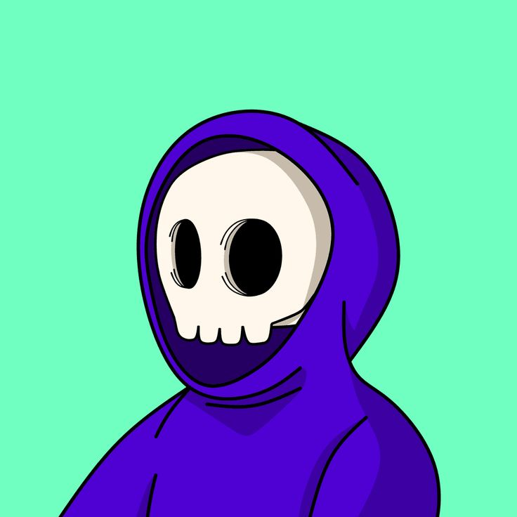

---

 

---

# About Me

Hello! I'm Shara Shahverdian, an enthusiast who loves everything related to computers, programming, and design. I find joy in crafting digital experiences and bringing ideas to life through code and creativity.

## Background

I hold a Bachelor's degree in Computer Science, which has equipped me with a solid understanding of technology and its applications. My journey has led me to explore various aspects of the digital realm, allowing me to appreciate the intricate balance between form and function.

## Interests

- Computer Programming: I enjoy transforming ideas into functional software solutions, constantly pushing the boundaries of what's possible.
- Designing: Creating visually appealing designs that not only look great but also enhance user experiences is something I'm genuinely passionate about.

## Skills
- Intermediate Skills: Proficient in Python, HTML, CSS, JavaScript, React, and TypeScript, enabling me to create interactive and dynamic web applications.
- Version Control: I'm familiar with Git and GitHub, which helps me collaborate effectively and track changes in my projects.

Feel free to connect with me via [email](sharashahverdian@gmail.com).
